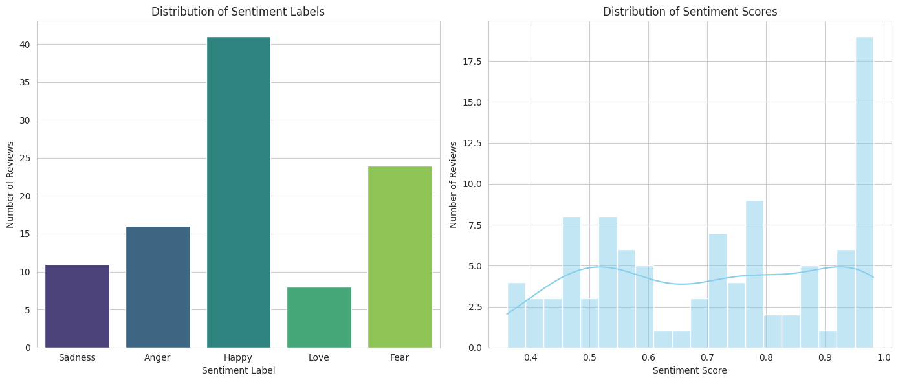

from weasyprint import HTML

## 📊 UTS Big Data - Analisis Sentimen & Visualisasi

* Nama   : Rama Ilham Ramadhan
* NIM    : 14022300024
* Kelas  : 6B-BIS


Repository ini berisi projek **Ujian Tengah Semester (UTS)** untuk mata kuliah **Big Data**. Projek ini difokuskan pada pengolahan data skala besar, analisis sentimen, serta teknik visualisasi data menggunakan Python.

## 🚀 Fitur Utama
- **Data Preprocessing**: Pembersihan data mentah (cleaning, filtering, stopword removal).
- **Sentiment Analysis**: Klasifikasi teks untuk menentukan polaritas sentimen.
- **Exploratory Data Analysis (EDA)**: Visualisasi distribusi data untuk mendapatkan insight yang mendalam.
- **Big Data Processing**: Implementasi algoritma pengolahan data yang efisien.

## 🛠️ Teknologi yang Digunakan
- **Bahasa Pemrograman**: Python
- **Libraries**: 
  - `Pandas` & `NumPy` (Manipulasi Data)
  - `Matplotlib` & `Seaborn` (Visualisasi)
  - `NLTK` / `Scikit-learn` (Pemrosesan Bahasa Alami & ML)
  - `Jupyter Notebook` (Environment Pengembangan)

## Visualisasi Analisis Sentimen


## 📁 Struktur Projek
```text
├── data/               # Kumpulan dataset (CSV/JSON)
├── notebooks/          # File .ipynb untuk analisis
├── src/                # Script Python pendukung
└── README.md           # Dokumentasi projek

